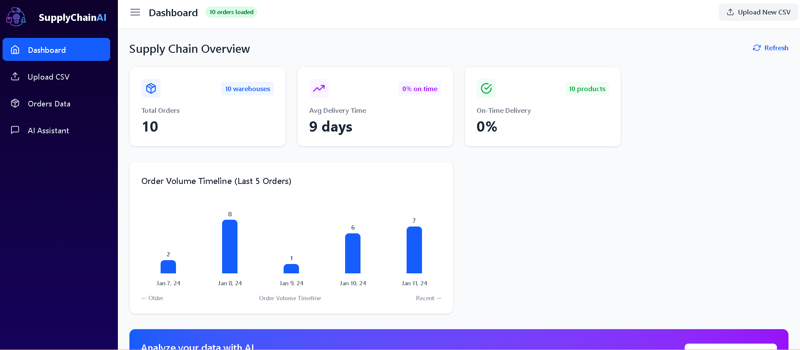
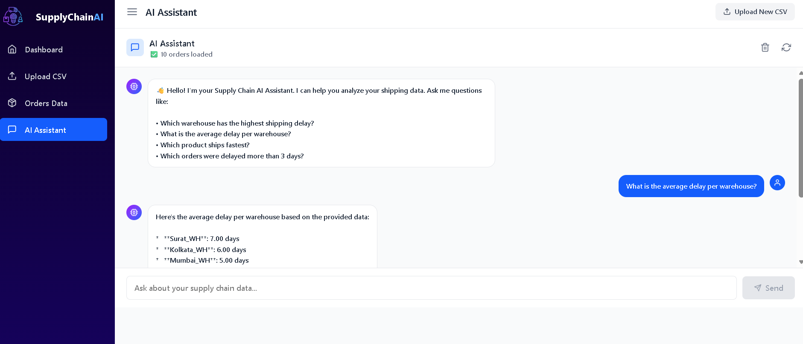
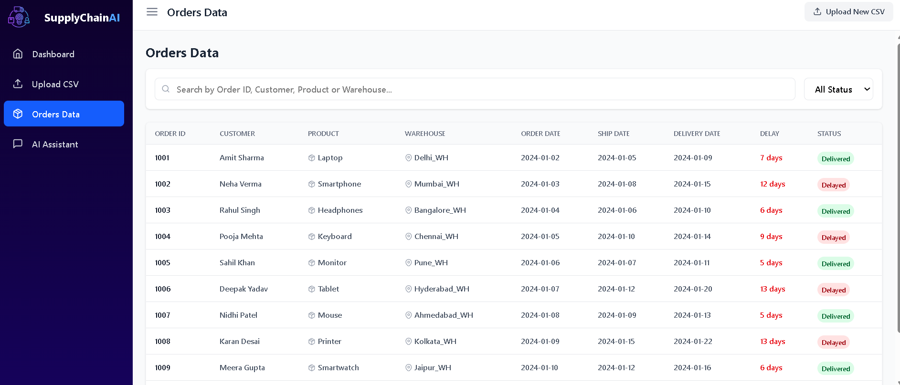
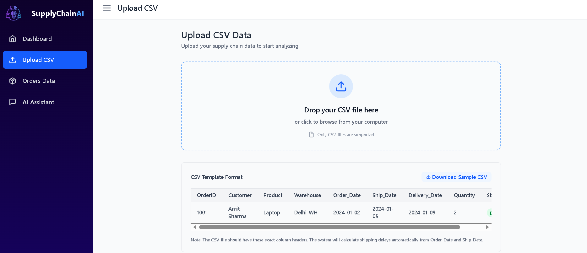

# 📦 Supply Chain AI Copilot

An intelligent AI-powered assistant that helps supply chain managers analyze shipping data through natural language conversations. Upload your CSV files and get instant insights about warehouse performance, shipping delays, and order patterns.

---

## ✨ Features

- **📤 CSV Data Upload** – Drag & drop interface for shipping data  
- **🤖 Natural Language Queries** – Ask questions in plain English  
- **📊 Real-time Dashboard** – Live metrics and analytics  
- **📋 Orders Management** – Search, filter, and view all orders  

---

## 🏗️ Tech Stack

### Frontend
- **React 18** – UI library  
- **Tailwind CSS** – Styling  
- **React Icons** – Icon library  
- **Axios** – HTTP client  

### Backend
- **Node.js** – Runtime environment  
- **Express** – Web framework  
- **Multer** – File upload handling  
- **Papaparse** – CSV parsing  
- **Google Gemini API** – AI/LLM integration  

---

## 📋 Prerequisites

Before you begin, ensure you have installed:
- **Node.js** (v14 or higher)  
- **npm**  
- **Git**  

You'll also need:
- **Google Gemini API Key** (free tier available at [Google AI Studio](https://aistudio.google.com/))  

---

## 🚀 Installation

### Step 1: Clone the Repository
```bash
git clone https://github.com/your_username/SupplyChainGenAI.git
cd SupplyChainGenAI
```

---
### Step 2: Navigate to backend folder
```bash
cd backend
```
- #### Install dependencies
```bash
  npm install
```
- #### Start the backend server
```bash
  npm run dev
```
---

### Step 3: Navigate to frontend folder
```bash
cd frontend
```
- #### Install dependencies
```bash
  npm install
```
- #### Start the development server
```bash
  npm start
```
---

### Step 4: Access the Application
http://localhost:5173

---

## 🚀 Project Structure
```bash
Supply_Chain/
├── backend/
│   ├── routes/
│   │   ├── upload.js          # CSV upload handling
│   │   └── chat.js            # AI chat integration
│   │   └── debugData.js       # uploaded csv information
│   ├── data/
│   │   └── memoryStore.js     # In-memory data storage
│   ├── utils/
│   │   └── csvParser.js        # csv parser
│   ├── uploads/               # Temporary upload folder
│   ├── .env                   # Environment variables
│   └── server.js              # Main server file
├── frontend/
│   ├── src/
│   │   ├── components/
│   │   │   ├── Orders.jsx      # Orders table
│   │   │   ├── ChatAI.jsx      # AI chat interface
│   │   │   └── UploadCSV.jsx   # File upload component
│   │   ├── App.jsx             # Main app component
│   │   └── main.jsx            # Entry point
│   └── index.html
└── README.md


```
---

### CSV Format

---
OrderID,Customer,Product,Warehouse,Order_Date,Ship_Date,Delivery_Date,Quantity,Status
1001,Amit Sharma,Laptop,Delhi_WH,2024-01-02,2024-01-05,2024-01-09,2,Delivered


## 🚀 How to Use

#### Upload Data
- Click on "Upload CSV" in the sidebar
- Drag & drop your CSV file or click to browse
- Wait for upload to complete
- You'll be automatically redirected to the dashboard
---

#### View Dashboard
- See key metrics: Total Orders, Avg Delivery Time
- Check order volume timeline
---


#### Explore Orders
- Click "Orders Data" in the sidebar
- Search by order ID, customer, or product
- Filter by status (Delivered/Delayed)
- View detailed order information
---

#### Ask Questions
- Click "AI Assistant" in the sidebar
- Get instant AI-powered answers

---

### ScreenShots of the Application

## 📸 Screenshots

### Dashboard View


---

### AI Assistant Chat


---

### Orders


---

### Upload CSV



